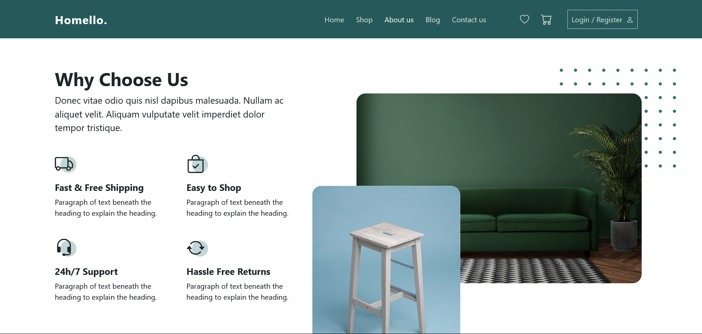

# **Homello**

**Homello** is an open-source home furniture e-commerce web app built with **Vue.js**.

**Website :** visit [https://homello.netlify.app/](https://homello.netlify.app/)

## **Overview**

[](https://opensource.org/licenses/OpenModification)

**Homello** aims to provide a seamless and user-friendly experience for browsing and purchasing home furniture. The project focuses on creating a secure platform for users to discover, explore, and shop for high-quality home and office furnishings and decorations.

## **Tech Stack**

- **Node.js:**
- **Vue.js:**
- **HTML:**
- **CSS:**
- **JavaScript:**
- **Bootstrap:**

## **Features**

- **Intuitive UI:** Clean and user-friendly interface for a pleasant shopping experience.
- **Responsive Design:** Accessible and functional across various devices and screen sizes.
- **Vue.js:** Built with **Vue.js** for a modular and efficient frontend.

## **Screenshots and Videos**

Check out some captures of the web app in action !


**About Page:**



**Shop Page:**


**Watch videos instead :**
[Watch Demo Video](app_captures/homello-project-video-001.mp4)
[Watch Demo Video 2](app_captures/homello-project-video-002.mp4)

## **Installation**

Follow these steps to set up **Homello** locally:

### Prerequisites

- Node.js: Make sure you have Node.js installed on your machine.

### Steps

1. Clone the repository:

   ```bash
   git clone https://github.com/your-username/Homello.git
   ```

2. Navigate to the project directory:

   ```bash
   cd Homello
   ```

3. Install dependencies:

   ```bash
   npm install
   ```

4. Run the development server:

   ```bash
   npm run dev
   ```

5. Open your browser and visit [http://localhost:PORT](http://localhost:PORT)

## **Further Improvements**

- Implement a secure authentication system for user accounts.
- Integrate a robust backend for data storage and management.
- Implement funtionalities for Add to cart/Add to Favorites
- Enhance the user interface with additional features and animations.
- Explore internationalization (i18n) for multi-language support.

## **Contributing**

Contributions are welcomed, for further modifications, improvements, or any questions, feel free to reach out to me via email at :

- **Email:** [dev.axeltokam@gmail.com](mailto:dev.axeltokam@gmail.com)
- **Twitter:** [](https://twitter.com/axeltokam)
- **LinkedIn:** [](https://www.linkedin.com/in/axeltokam/)

## **License**

This project is licensed under the Open Modification License, allowing for modifications. However, please ensure that any modified projects do not use the same name due to trademark considerations. See the [LICENSE](LICENSE) file for details.
